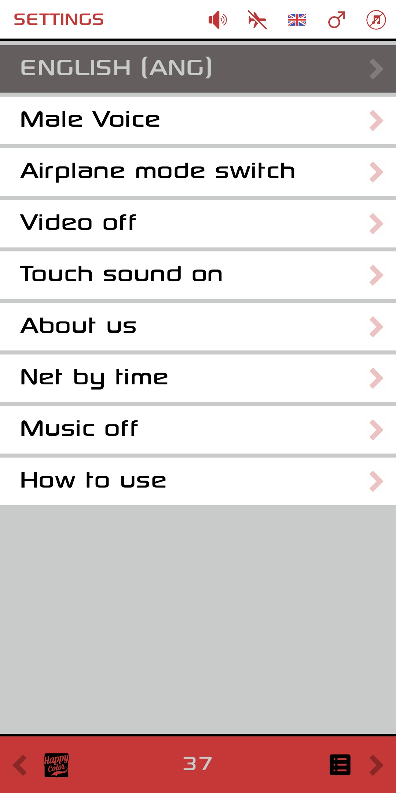

# Meditation App

Python Kivy Android app. Besides many features, it includes:  
- Audio playback – via Pyjnius  
- Video playback – via Pyjnius  
- Calling Android intents – via Pyjnius  
nano README.md- Drag and drop – manual code  
- Airplane mode status check – via Pyjnius  
- Network connectivity check – manual code  
- Loading images from the internet – manual code  
- And other interesting features

## Screenshot

## Download

[Click here tonano README.md download the latest APK](https://github.com/devpapet/meditation-app/releases/latest/download/med34.apk)# meditation-app
Python Kivy Android app
